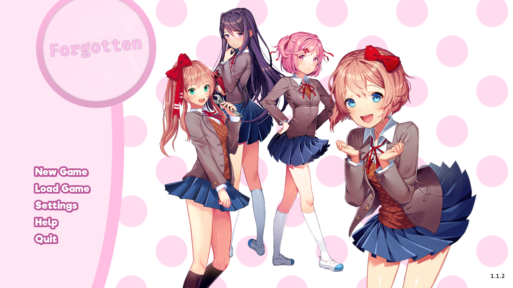

# Forgotten (Project Stein)

    

Forgotten is a mod for **Doki Doki Literature Club!** (DDLC) created and maintained by the Project Alice team. Set after the events of DDLC, Sayori takes on the challenges of leading the literature club while the other members deal with Monika's sudden disappearance and the arrival of Sayonika, a cheerful classmate with a passion and craft in programming. However, when strange things start happening around campus and the neighborhood, it's up to the club, with the help of newly-arrived Alice Angel, to find out what's going on and where Monika disappeared to.

## Build Instructions

Building Project Stein is similar to any DDLC mod project, which can be easily loaded using Ren'Py 6.99.12.4. 

### Xcode Compatibility

If you are using Xcode 9.3 or higher, you can open this project directly and change `RENPY_TOOL` in Config.xcconfig (and the Executable in the Run Scheme) to reflect where your copy of Ren'Py SDK is located. After changing these settings, you're able to use the standard Build and Run features of Xcode to test Project Stein.

> Note: Xcode doesn't have full support for the Ren'Py language, so make sure to be careful as it will force Python syntax highlighting.

## License

Forgotten, a mod for Doki Doki Literature Club

Copyright (C) 2019 Project Alice

This program is free software: you can redistribute it and/or modify
it under the terms of the GNU General Public License as published by
the Free Software Foundation, either version 3 of the License, or
(at your option) any later version.

This program is distributed in the hope that it will be useful,
but WITHOUT ANY WARRANTY; without even the implied warranty of
MERCHANTABILITY or FITNESS FOR A PARTICULAR PURPOSE.  See the
GNU General Public License for more details.

You should have received a copy of the GNU General Public License
along with this program.  If not, see <http://www.gnu.org/licenses/>.

## Disclaimer

> Forgotten is a fan mod that is not associated with Team Salvato or Joey Drew Studios and is not an official Bendy and the Ink Machine product. Please read our [guideline spec](https://theangelreturns.aliceos.app/policies.html) for more information. For the best experience, it is recommended that you play _Doki Doki Literature Club!_ and _Bendy and the Ink Machine_ before playing Forgotten.
> Apple, the Apple logo, iPhone, iPad, Apple Store, and Mac Pro are trademarks of Apple Inc., registered in the U.S. and other countries and regions.
